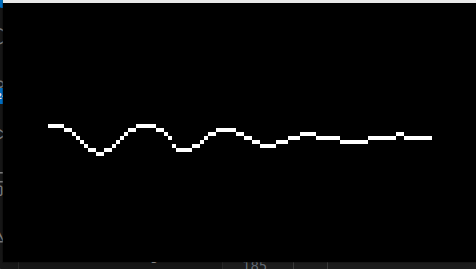
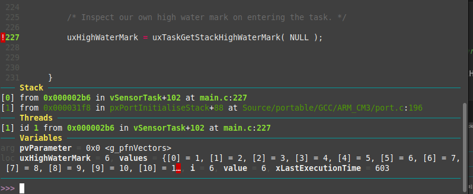
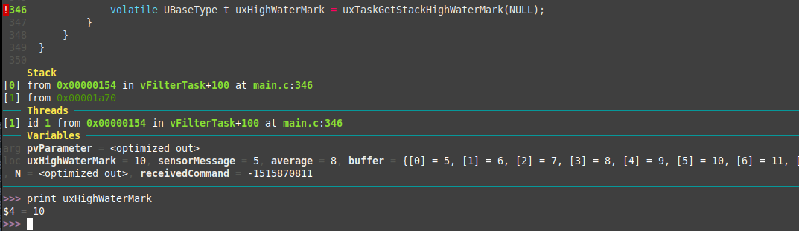
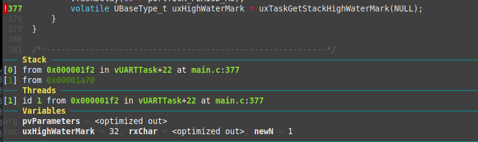
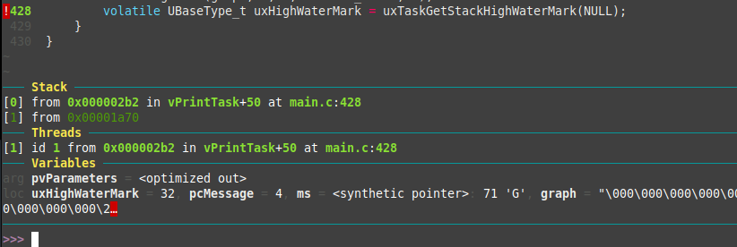

# Trabajo Práctico 4 - SOII - 2024

Luego de haber estudiado de manera teórica los sitemas operativos de timepo real, se pide desarrollar una aplicación utilizando FreeRTOS donde una placa de desarrollo Stellaris LM3S811 (emulada con qemu) funcionará como generador de una señal (como si fuera un sensor de temperatura) que enviará las entradas leídas a un filtro pasabajos para , finalmente, realizar un gráfico que saldrá a través de un display OLED. Para el desarrollo del trabajo se utilizarán las tareas (tasks) que nos brinda FreeRTOs y los mecanismos de comunicación entre estos llamados colas (queue).

### Creación de recursos e inicialización del HW

Para comenzar lo primero que se hace desde la función main es crear las distintas tareas que se ejecutarán en paralelo mientras son manejadas por scheduler. 

```c
int main( void )
{
	/* Configure the clocks, UART and GPIO. */
	prvSetupHardware();

	/* Create the queue used to pass message to vPrintTask. */
	xPrintQueue = xQueueCreate( mainQUEUE_SIZE, sizeof( int ) );

	xSensorValueQueue = xQueueCreate( mainQUEUE_SIZE, sizeof(int));

	xNValueQueue = xQueueCreate( mainQUEUE_SIZE, sizeof(int));


	/* Start the tasks defined within the file. */
	xTaskCreate( vSensorTask, "Sensor", configMINIMAL_STACK_SIZE + 3, NULL, mainTASK_PRIORITY , NULL);
	xTaskCreate( vFilterTask, "Filter", configMINIMAL_STACK_SIZE + 3, NULL, mainTASK_PRIORITY , NULL);
	xTaskCreate( vPrintTask, "Print", configMINIMAL_STACK_SIZE, NULL, mainTASK_PRIORITY , NULL );
	xTaskCreate( vUARTTask, "UART", configMINIMAL_STACK_SIZE , NULL, mainTASK_PRIORITY - 1, NULL );
	xTaskCreate( vTaskGetRunTimeStatsTask, "Stats", configMINIMAL_STACK_SIZE, NULL, mainTASK_PRIORITY - 2 , NULL);

	/* Start the scheduler. */
	vTaskStartScheduler();

	/* Will only get here if there was insufficient heap to start the
	scheduler. */

	return 0;
}
```

Además, debemos inicializar el HW (UART, Clock y Display) desde la función prvSetupHardware.

```c

static void prvSetupHardware( void )
{
		/* Setup the PLL. */
	SysCtlClockSet( SYSCTL_SYSDIV_10 | SYSCTL_USE_PLL | SYSCTL_OSC_MAIN | SYSCTL_XTAL_6MHZ );

	vSetupHighFrequencyTimer();

	/* Enable the UART.  */
	SysCtlPeripheralEnable(SYSCTL_PERIPH_UART0);

	/* Configure the UART for 8-N-1 operation. */
	UARTConfigSet( UART0_BASE, mainBAUD_RATE, UART_CONFIG_WLEN_8 | UART_CONFIG_PAR_NONE | UART_CONFIG_STOP_ONE );

	/* We don't want to use the fifo.  This is for test purposes to generate
	as many interrupts as possible. */
	HWREG( UART0_BASE + UART_O_LCR_H ) &= ~mainFIFO_SET;

	/* Initialise the LCD> */
    OSRAMInit( false );
    OSRAMStringDraw("Lab 4 - SOII", 16, 0);
	OSRAMStringDraw("LM3S811 ", 16, 1);
}

```


### Sensor 

Para generar la señal de entrada del sistema utilizamos un arreglo de valores enteros que son enviados uno por uno desde la terea del sensor a la tarea de filtrado a través de una queue llamada xSensorValueQueue. Esto se realiza de manera periódica cada 0.1 [s].

```c

static void vSensorTask(void *pvParameter)
{
	int values[23] = {1, 2, 3, 4, 5, 6, 7, 8, 9, 10, 11, 12, 11, 10, 9, 8, 7, 6, 5, 4, 3, 2, 1};
	int i = 0;
	int value = 0;
	TickType_t xLastExecutionTime;
	xLastExecutionTime = xTaskGetTickCount();

	for( ;; )
	{
		vTaskDelayUntil( &xLastExecutionTime, mainCHECK_DELAY );
		
		value = values[i];

		xQueueSend( xSensorValueQueue, &value, portMAX_DELAY ); // send the value to the filter
		if(i == 22){ i = 0;}
		else { i++; }

	}

}


```


### Filtro

El filtro pasabajos básicamente recibe las entradas provenientes del sensor y para realizar el filtrado calcula el promedio de los últimos N valores, siendo N un valor que puede ser modificado a través de una señal UART mediante un comando en la consola del usuario. Luego del cálculo del promedio se envía a la tarea de graficación.

```c

static void vFilterTask( void *pvParameter )
{
	int sensorMessage; // received from the sensor
	int average; // sent to print
	int buffer[MAX_BUFFER_SIZE]; // buffer with last N temperatures
	int N = 10; 
	int receivedCommand;

	for( ;; )
	{
		if (xQueueReceive(xSensorValueQueue, &sensorMessage, portMAX_DELAY) == pdPASS)
        {

        	if (xQueueReceive(xNValueQueue, &receivedCommand, 0) == pdPASS)
        	{
            	if(receivedCommand == 1)
            	{
            		(N + 1 > MAX_BUFFER_SIZE - 1) ? N = MAX_BUFFER_SIZE : N++;
            	}
            	else if(receivedCommand == 0)
            	{
            		(N - 1 <= 0) ? N = 1 : N--;
            	}
        	}

        	average = 0;

        	for(int i = N-1;i > 0; i--)
        	{
       			buffer[i] = buffer[i-1];
       			average += buffer[i];
        	}

        	buffer[0] = sensorMessage;
        	average += sensorMessage;

        	average = average / N; //we take the average

            // Send the average to the print queue
            xQueueSend(xPrintQueue, &average, portMAX_DELAY);
        }	
    }
}

```

### Cambiar N vía UART

Como ya habíamos mencionado anteriormente, se puede cambiar la cantidad de muestras que tendrá en cuenta el filtro a la hora de realizar el promedio a través de comandos de consola. En este caso particular se optó por utilizar los comandos '+' y '-' para aumentar en uno y restar uno respectivamente el valor de N, con un máximo de 20 valores. El comando es enviado a la tarea del filtro a través de la queue xNValueQueue.

```c

void vUARTTask(void *pvParameters)
{
	
    char rxChar;
    int newN;

    for (;;)
    {
        if(UARTCharsAvail(UART0_BASE))
        {
        	rxChar = UARTCharGet(UART0_BASE);

		    if (rxChar == '+')
		    {
		        newN = 1;
		        xQueueSend(xNValueQueue, &newN, portMAX_DELAY);
		    }
		    else if (rxChar == '-')
	        {
	            newN = 0;
		        xQueueSend(xNValueQueue, &newN, portMAX_DELAY);
		    }
		}

		vTaskDelay(10 / portTICK_PERIOD_MS);
    }
}

```

Vemos en la imagen como a medida que se van mandando señales de '-' se disminuye la cantidad de valores a tomar y se forma una señal con derivada más pronunciada. 



### Gráfico

Para graficar la seña se utilizó un Display OLED y su driver, el cual posía una función capaz de graficar un bitmap como se lo indicamos. En este caso se utiliza una función llamada ```intToChar```, la cual recibe como parámetros el buffer donde esta guardada la imagen y el nuevo valor a agregar. Se reemplazan los valores viejos corridos un lugar + 1 y se traduce el nuevo valor a agregar a su correspondiente símbolo o bit. Para esto es importante entender que el driver del display maneja los 96x16 bits como un arreglo de 192 elementos donde la primera mitad corresponde a la primera fila de la matriz que representa el bitmap, y la segunda mitad de valores corresponde a la segunda fila.

```c
void intToChar(unsigned char graph[2*DISPLAY_WIDTH],int value)
{
	for(int i = DISPLAY_WIDTH - 1; i > 0;i--)
	{
		graph[i] = graph[i-1];
		graph[i + DISPLAY_WIDTH] = graph[i + DISPLAY_WIDTH - 1];
	}

	graph[DISPLAY_WIDTH] = 0;
	graph[0] = 0;

	if(value < 8)
	{
		graph[DISPLAY_WIDTH] = (1 << (7 - value));
	}
	else
	{
		graph[0] = (1 << (15 - value));
	}
	
}

/*-----------------------------------------------------------*/

static void vPrintTask( void *pvParameters )
{
	int pcMessage; // new value

	static unsigned char graph[2 * DISPLAY_WIDTH] = {0};

	for( ;; )
	{
		/* Wait for a message to arrive. */
		xQueueReceive( xPrintQueue, &pcMessage, portMAX_DELAY );

		intToChar(graph, pcMessage);

		OSRAMClear();
		OSRAMImageDraw(graph, 0, 0, DISPLAY_WIDTH, 2);
	}
}
```

### Water Mark

Para calcular el valor de stack mínimo necesario para cada tarea se utiliza las funcionalidades propias de FreeRTOS que nos devuelven la marca de agua (Water Mark) de cada tarea. Esta hace referencia a la cantidad bytes que podían ser agregados al stack en su momento de mayor uso. Con esta información podemos determinar si nuestro valor de stack asignado a cada tarea es mucho, poco o esta justo. En la carppeta /image se encuentras las capturas de gdb donde se realiza el dbugging y print de la varible que contiene el valor de la Water Mark en cada tarea. 

```c
	UBaseType_t uxHighWaterMark;


    /* Inspect our own high water mark on entering the task. */

    uxHighWaterMark = uxTaskGetStackHighWaterMark( NULL );

```

- Sensor
	

- Filtro
	

- UART

	

- Gráfico
	

### Monitor

Por último se pide realizar una tarea que envíe datos de los proceos (tareas) que se están ejecutando en el sistema como el uso de la CPU, el estado en el que se encuentran o su Water Mark.
Para esto se utiliza la función ```uxTaskGetSystemState``` la cual nos devuelve un arreglo con información de cada tarea que se encuentra ejecutándose en el sistema. Toda esta información es enviada hacia la consola a través de la comunicación UART.

```c

void vPrintStats(TaskStatus_t *pxTaskStatusArray) {
    volatile UBaseType_t uxArraySize, x;
    unsigned long ulTotalRunTime, ulStatsAsPercentage;

    if (pxTaskStatusArray != NULL) {
        uxArraySize = uxTaskGetSystemState(pxTaskStatusArray, uxArraySize, &ulTotalRunTime);
        ulTotalRunTime /= 100UL;

        if (ulTotalRunTime > 0) {
        	UARTSendString("\x1B[2J\x1B[H");
        	UARTSendString("Task \tCPU usage\tState\tWater Mark \n");
            for (x = 0; x < uxArraySize; x++) {
                ulStatsAsPercentage = pxTaskStatusArray[x].ulRunTimeCounter / ulTotalRunTime;
                //
                // Send task name
                UARTSendString(pxTaskStatusArray[x].pcTaskName);

                // Send tab character
                UARTSendChar('\t');

                // Send ulStatsAsPercentage as a string
                if(ulStatsAsPercentage <= 0){
                	UARTSendString("<0");
                }
                else
                {
                	UARTSendString(ultoa(ulStatsAsPercentage));
                }
                // Send percentage sign and newline
                UARTSendChar('%');
                UARTSendChar('\t');
                UARTSendChar('\t');

                switch (pxTaskStatusArray[x].eCurrentState) {
				    case eRunning:
				      UARTSendString("Running");
				      break;
				    case eReady:
				      UARTSendString("Ready");
				      break;
				    case eBlocked:
				      UARTSendString("Blocked");
				      break;
				    case eSuspended:
				      UARTSendString("Suspended");
				      break;
				    case eDeleted:
				      UARTSendString("Deleted");
				      break;
				    case eInvalid:
				      UARTSendString("Invalid");
				      break;
				}

				UARTSendChar('\t');

                UARTSendString(ultoa(pxTaskStatusArray[x].usStackHighWaterMark));
                UARTSendChar('\n');
                
                
            }
        }
    }
}


/*-----------------------------------------------------------*/

static void vTaskGetRunTimeStatsTask(  void *pvParameters )
{

    TaskStatus_t *pxTaskStatusArray;
    volatile UBaseType_t uxArraySize;
    

   	TickType_t xLastExecutionTime;
	xLastExecutionTime = xTaskGetTickCount();

	uxArraySize = uxTaskGetNumberOfTasks();

	pxTaskStatusArray = pvPortMalloc( uxArraySize * sizeof( TaskStatus_t ) );

	if (pxTaskStatusArray == NULL) {
    	for (;;)
      		;
  	}


   	for(;;)
   	{
   		vTaskDelayUntil( &xLastExecutionTime, printSTATS_DELAY );
	   	vPrintStats( pxTaskStatusArray);
	}
}
```

](image/monitor.png)

### Debugging

Para el correcto debbuging del programa se utilizó gdb-multiarch, el cual es el debugger de GNU pero con soporte para múltiples arquitecturas (en nuestro caso era una arquitectura ARM y donde se intentaba correr era x86). La seguidilla de comandos era la siguiente:

```bash
gdb-multiarch gcc/RTOSDemo.axf

target remote :1234

break main   //por ejemplo
```

